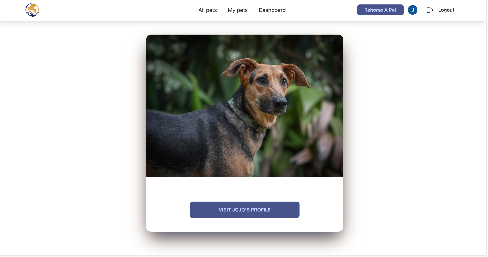
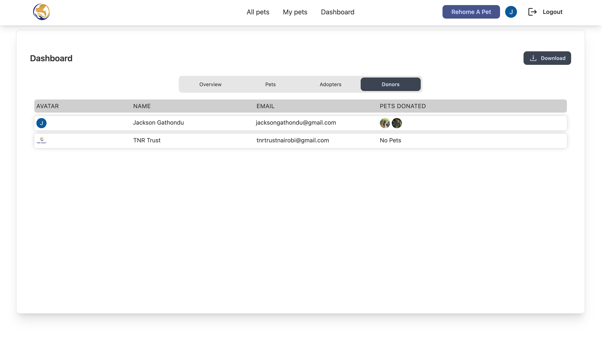

# PawfectAfrica

## Pet Adoption Management App

This app can be used by a pet rescue NGOs to manage the adoption process. It features a tinder-style dashboard with swipeable cards that make adoption easy and fun.

## Features
Swipeable cards. These cards contain images of the pets that are available for adoption. A potential adopter can swipe right to mark a pet as a favorite or swipe left to remove it from the dashboard. They can then apply to adopt a particular pet from the app. The donor of the pet can accept or decline the adoption request after a phone interview. 
### Pages

Admin Dashboard. The admin has visibility of the entire adoption process as well as all the pets available for adoption. He/She can create, edit and delete pet data on the app. The admin can also allow third parties to also put their pets on the website to get matched with potential adopters. They can charge those putting the pet on adoption a fee to use the service. 
### Admin Dashbaord

## Technologies used

Below are the main technologies used and their respective documentation: 

- [Next.js](https://nextjs.org)
- [NextAuth.js](https://next-auth.js.org)
- [Prisma](https://prisma.io)
- [Tailwind CSS](https://tailwindcss.com)
- [tRPC](https://trpc.io)

## How do I set up and deploy this?
## Set Up and Usage
1. Clone this repo to your desktop
2. Navigate to the root directory folder and run npm install to install all the dependencies. Once the dependencies are installed, you can run npm run dev to start the application. You will then be able to access it at localhost:3000
4. Create a AWS s3 bucket account and get the environment variables needed to store images to the storeage.  Save the API keys to your environment variables.
5. Add a dabase connection url . You can use any sql database such as MySQL or Postgresql.
6. Add and edit the NextAuth authentication variables. 
7. Make any changes and deploy to github.
8. Set up a vercel account using your github account. 
9. Follow the following steps to deploy the [github repository](https://vercel.com/docs/concepts/deployments/git#deploying-a-git-repository). 
## License 
This project is licensed under the terms of the MIT license.
## Contacts
Any inquiries? Email me at: jackgathondu@gmail.com

