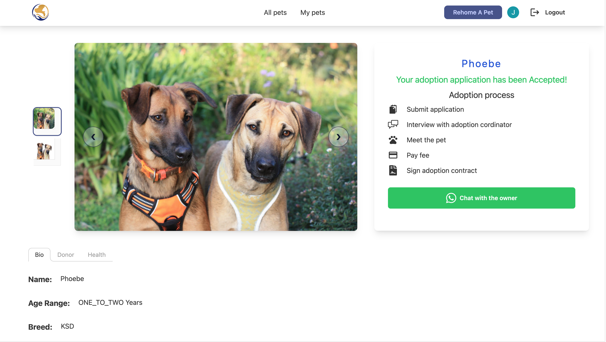
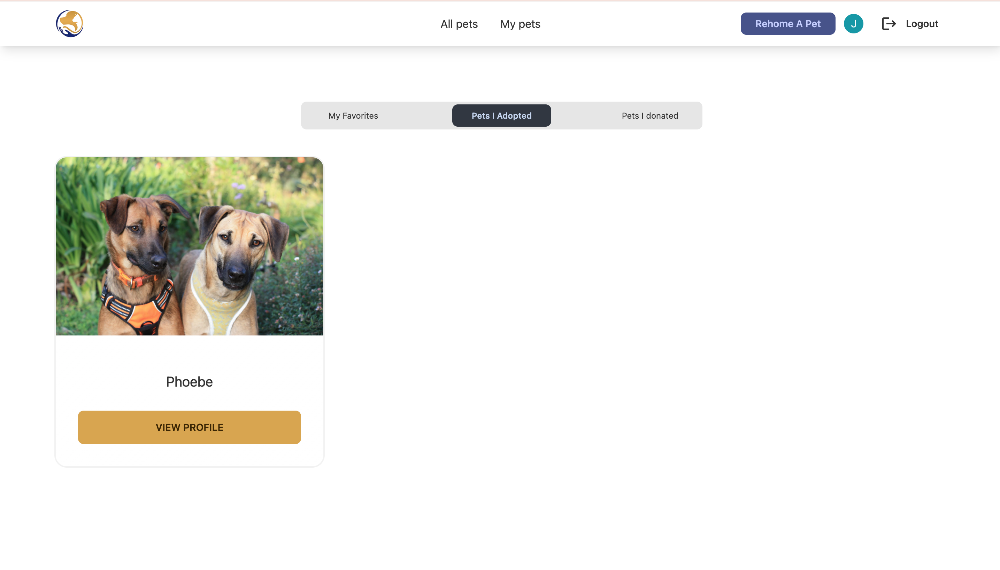
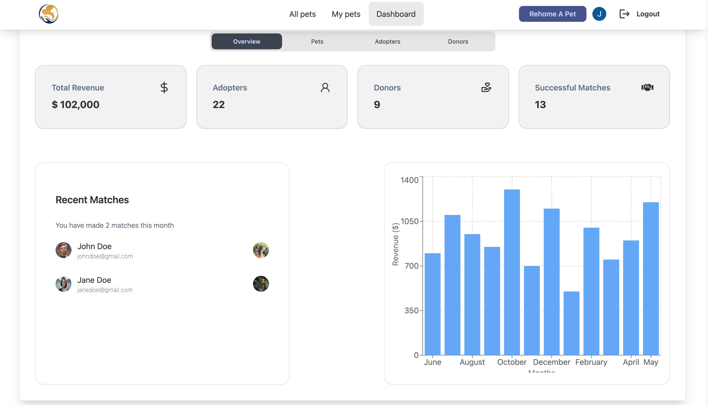
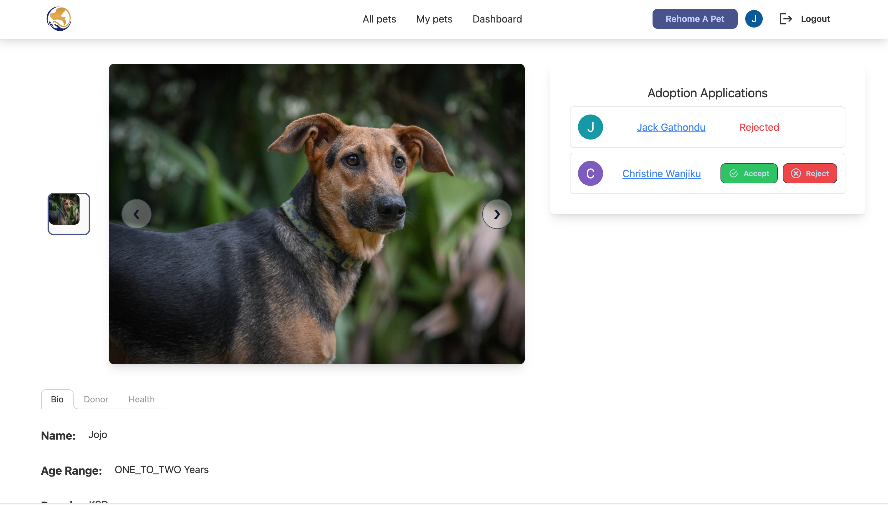

# PawfectAfrica

## Pet Adoption Management App

This app can be used by pet rescue NGOs to manage the adoption process. It features a Tinder-style dashboard with swipeable cards that make adoption easy and fun.

## Features
Swipeable cards: These cards contain images of the pets available for adoption. Potential adopters can swipe right to mark a pet as a favorite or swipe left to remove it from the dashboard. They can then apply to adopt a particular pet from the app. The donor of the pet can accept or decline the adoption request after a phone interview.

## Pages
### Browse Pets
Browse the available pets and add the ones you like to a list of favorites. You can then apply to adopt any of your favorite pets.

### Apply to Adopt a Pet
Start the adoption journey by applying to adopt any pet on the platform.

### Manage Your Pets
View your favorite pets, pets that you have adopted, or pets you have donated on the website.

### Admin Dashboard
The admin has visibility of the entire adoption process as well as all the pets available for adoption. They can create, edit, and delete pet data on the app. The admin can also allow third parties to put their pets on the website to get matched with potential adopters. They can charge those putting the pet on adoption a fee to use the service.

### Manage Your Pet Rescue NGO
Have visibility of the animals that are under your care as well as the potential adopters. Make some money by charging others to donate their pets on the website.

### Accept or Decline Adoption Requests
Manage the adoption process efficiently and avoid lengthy paperwork.

### Allow Others to Rehome Their Pets
Parting ways with your pet takes an emotional toll on the owner. Make it easy for pet donors to find suitable homes for their pets.

## Technologies Used

Below are the main technologies used and their respective documentation:

- [Next.js](https://nextjs.org)
- [NextAuth.js](https://next-auth.js.org)
- [Prisma](https://prisma.io)
- [Tailwind CSS](https://tailwindcss.com)
- [tRPC](https://trpc.io)

## How to Set Up and Deploy

### Set Up and Usage
1. Clone this repo to your desktop.
2. Navigate to the root directory folder and run `npm install` to install all the dependencies. Once the dependencies are installed, you can run `npm run dev` to start the application. You will then be able to access it at `localhost:3000`.
4. Create an AWS S3 bucket account and get the environment variables needed to store images in the storage. Save the API keys to your environment variables.
5. Add a database connection URL. You can use any SQL database such as MySQL or PostgreSQL.
6. Add and edit the NextAuth authentication variables.
7. Make any necessary changes and deploy to GitHub.
8. Set up a Vercel account using your GitHub account.
9. Follow the steps outlined [here](https://vercel.com/docs/concepts/deployments/git#deploying-a-git-repository) to deploy the GitHub repository.

## License
This project is licensed under the terms of the MIT license.

## Contacts
Have any inquiries? Email me at: jackgathondu@gmail.com

